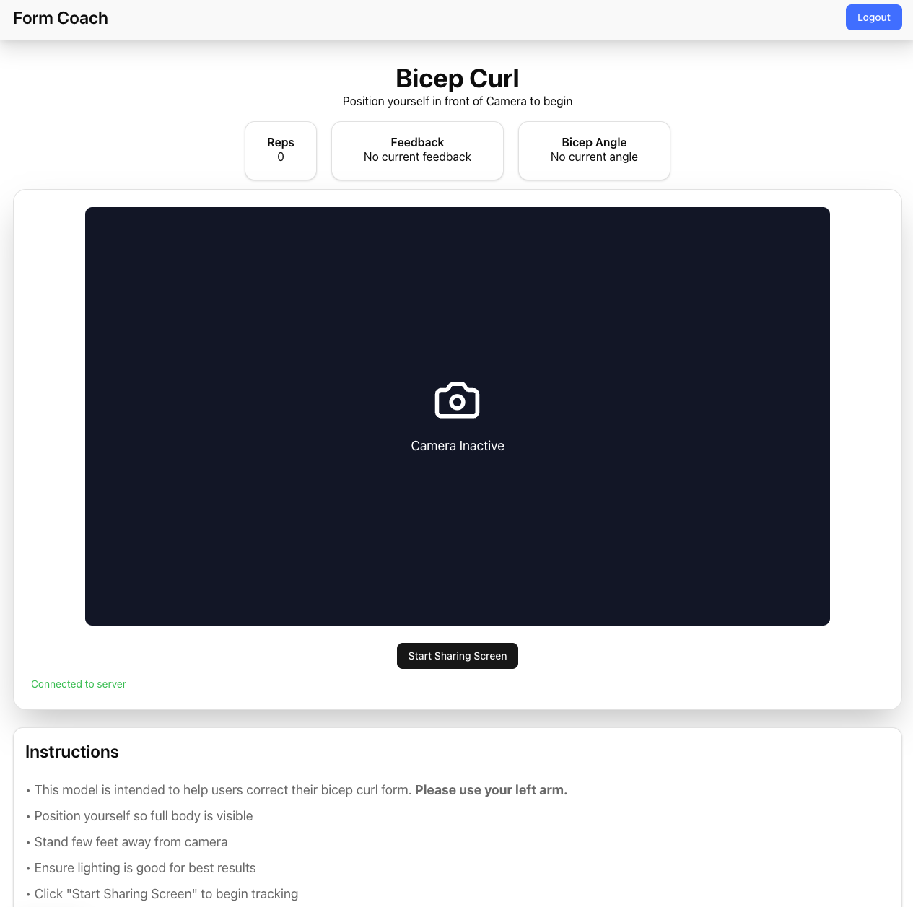

<h1 align='center'>
  Form Coach
</h1>
<p>A full stack computer vision application that allows users to correct their forms behind their computer.</p>

## Overview
This computer vision platform allows users to prevent injury and maximize gains. Through python's computer vision libaries it detects users joints and calculates the most efficient and optimal angles in specific workouts.



## Features
- **Spring Security + JWT Authentication**: For secure user credentials and authorization for specific requests.
- **WebSocket**: Allows real time feedback through bi-directional communication between client and server.
- **Python Microservice**: Returns pose detection analaysis and feeback to server which propagates to client via WebSocket.

## Project Structure
```
formcoach/
├── frontend/                    # Next.js frontend application
│   ├── src/
│   │   ├── api                  # AxiosInstance
│   │   ├── app/                 # Next.js app router pages
│   │   ├── components/          # Reusable React components
│   │   │   ├── ui/              # Shadcn UI components
│   │   │ 
│   │   ├── hooks/               # Custom React hooks
│   │   │ 
│   │   ├── context/             # React Context providers
│   │   ├── services/            # API service layers
│
├── backend/                     # Spring Boot backend application
│   ├── src/
│   │   ├── main/
│   │   │   ├── java/com/formcoach/
│   │   │   │   ├── config/      # Security, WebSocket, CORS configs
│   │   │   │   ├── controller/  # REST API endpoints
│   │   │   │   ├── dto/         # Data Transfer Objects
│   │   │   │   ├── controller/  # Exception hanlders
│   │   │   │   ├── models/      # JPA entities
│   │   │   │   ├── repository/  # Data access layer
│   │   │   │   ├── service/     # Business logic
│   │   │   │   ├── security/    # JWT, authentication 
│
│
├── python-service/              # Python pose detection microservice
│   ├── app/
│   │   ├── app.py               # FastAPI application entry point, pydantic models
```

## Tech Stack
**Frontend:**
- Next.js
- TypeScript
- Tailwind.css + Shadcn for styling
- STOMP.js & SockJS

**Backend**
- Spring Boot
- Spring Security
- Spring WebSocket
- Supabase/Postgres

**Python Microservice**
- Python
- OpenCV
- Mediapipe
- NumPy
- Fast API

# Getting Started
## Frontend
```
cd frontend
npm install
npm run dev
```
## Backend
```
cd formcoach-backend
./mvnw spring-boot:run
```
## Python
```
cd python-cv
pip install -r requirements.txt
uvicorn app:app --reload --port 5000
```

## Contributing
Contributions are welcome. Feel free to send pull requests.

## LICENSE
This project is licensed under the MIT license - see the LICENSE file for details.
